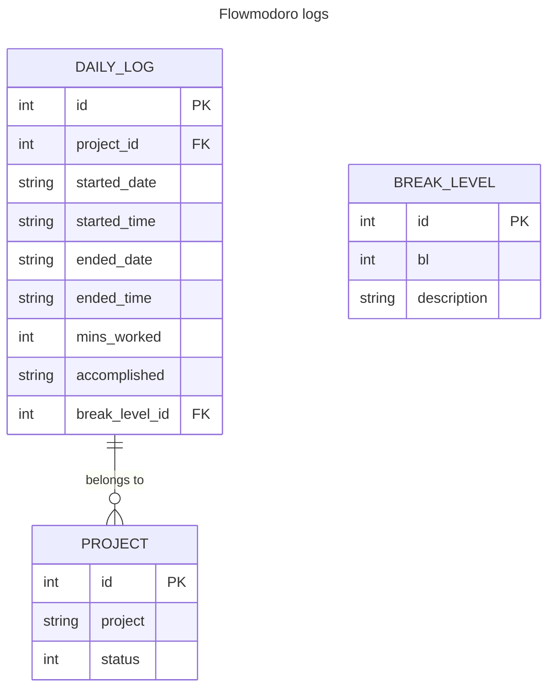

```mermaid
---
title: Flowmodoro logs
---
erDiagram
  DAILY_LOG {
    int id PK
    int project_id FK
    string started_date
    string started_time
    string ended_date
    string ended_time
    int mins_worked
    string accomplished
    int break_level_id FK
  }
  PROJECT {
    int id PK
    string project
    int status
  }
  BREAK_LEVEL {
    int id PK
    int bl
    string description
  }

  DAILY_LOG ||--o{ PROJECT : "belongs to"
```
