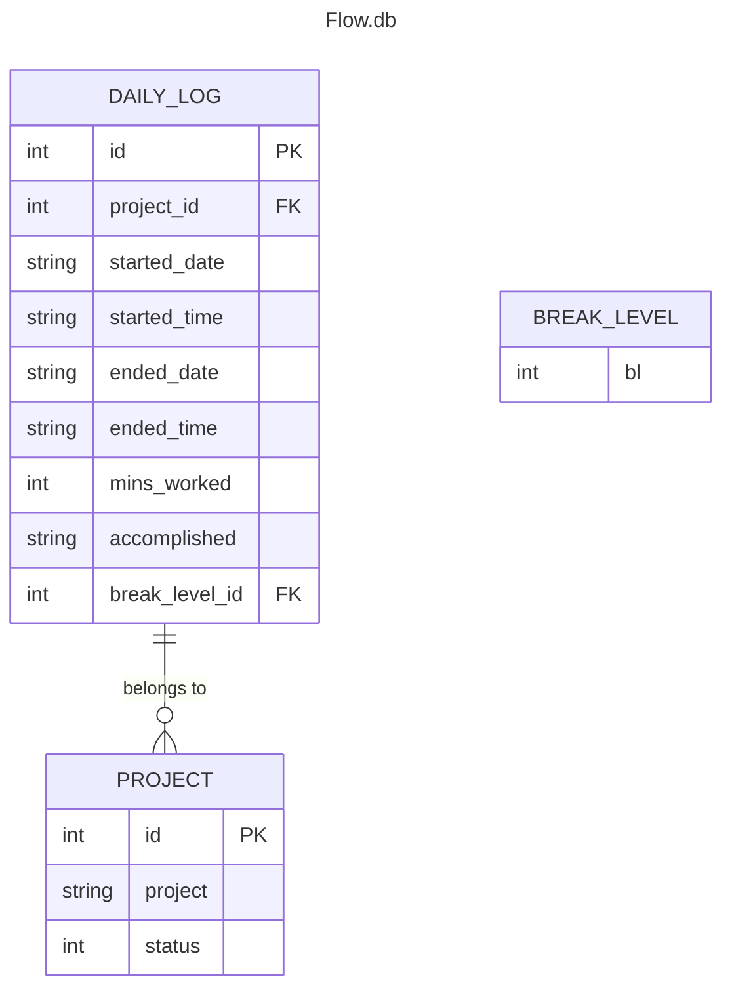

# Flowmodoro a Focus time tracker

A flexible time management tool inspired by Pomodoro technique.

## Description

Based in the popular time managment framework Pomodoro, improving it by beeing able to Start work sessions at your convenience, pause when concentration wanes, and let the system calculate optimal break times based on what Break Level you selected. Tailored productivity for individual rhythms, whether tackling projects or studying.

## Table of Contents

*   [Features](#features)
*   [Requirements](#requirements)
*   [Installation](#installation)
*   [Usage](#usage)
*   [Database Structure](#database-structure)
*   [Contributing](#contributing)
*   [License](#license)
*   [Author](#author)

## Features

## Requirements
- Python 3.6 or superior
- `pip`
- SQLite3


## Installation
1. Clone the repository

```bash
git clone https://github.com/Oddman43/Flowmodoro/tree/working
cd Flowmodoro
```

2. Install requeriments

```bash
pip install -r requeriments.txt
```


## Usage

## Database Structure

In SQLite3 (`flow.db`) contains 
The db schema can be found in 

### Entity Relationship Diagram



## Contributing

## License

## Author
