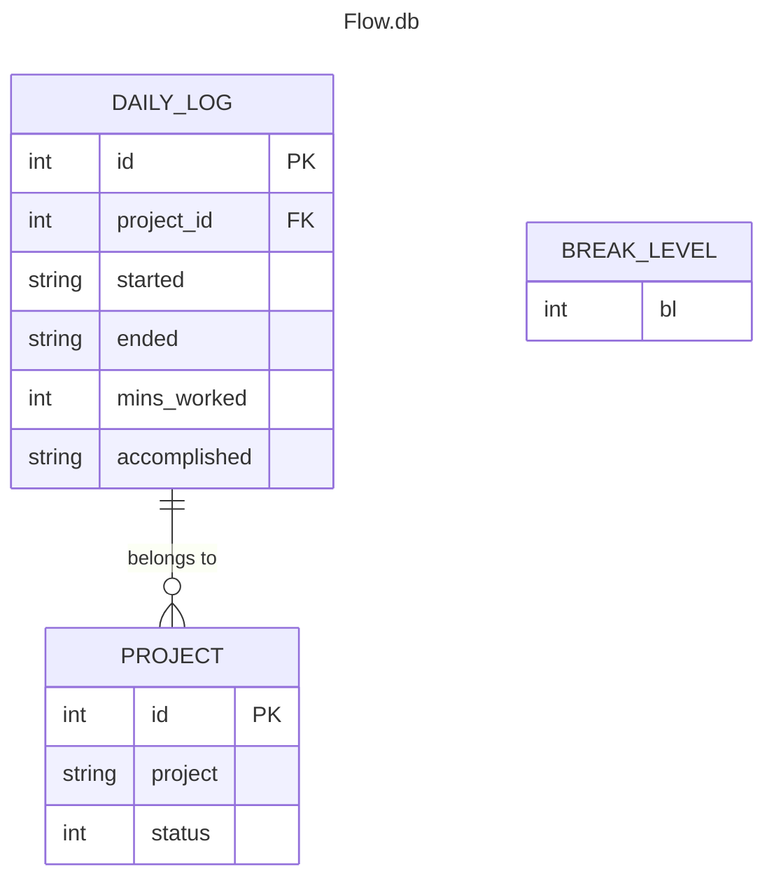

# Flowmodoro a Focus time tracker
A flexible time management tool inspired by Pomodoro technique.
## Description
Based in the popular time managment framework Pomodoro, improving it by beeing able to Start work sessions at your convenience, pause when concentration wanes, and let the system calculate optimal break times based on what Break Level you selected. Tailored productivity for individual rhythms, whether tackling projects or studying.
## Table of Contents
*   [Features](#features)
*   [Requirements](#requirements)
*   [Installation](#installation)
*   [Usage](#usage)
*   [Database Structure](#database-structure)
*   [Contributing](#contributing)
*   [License](#license)
*   [Author](#author)
## Features
## Requirements
- Python 3.6 or superior
- `pip`
- SQLite3
## Installation
1. Clone the repository
```bash
git clone https://github.com/Oddman43/Flowmodoro/tree/working
cd Flowmodoro
```
1. Install requeriments

```bash
pip install -r requeriments.txt
```
## Usage
## Database Structure
In SQLite3 (`flow.db`) contains three tables `daily_log` `project` `break_level` 
The db schema can be found in `flowmodoro_schema.sql` 
### Table `daily_log`

| Column        | Type | Description                                                                   |
| ------------- | ---- | ----------------------------------------------------------------------------- |
| id            | int  | Primary key, used to identify log                                             |
| project_id    | int  | Foreign key, used to relate to poject                                         |
| started  | str  | Date in YYYY-MM-DD HH:MM:ss corresponding to started date.<br>This column has an Index |
| ended    | str  | Date in YYYY-MM-DD HH:MM:ss corresponding to ended date                                |
| mins_worked   | int  | Number of minutes worked in cycle                                             |
| accomplisdhed | str  | Description of especific things worked on                                     |

### Table `project`

| Column  | Type | Description                                                           |
| ------- | ---- | --------------------------------------------------------------------- |
| id      | int  | Primary key, used to identify project                                 |
| project | str  | Name of the project                                                   |
| status  | int  | Soft deletion of projects, by default populates with 0 meaning active |

### Table `break_level`

| Column | Type | Description                                                                                                                                        |
| ------ | ---- | -------------------------------------------------------------------------------------------------------------------------------------------------- |
| bl     | int  | Break Level selected by default, uppon creation populates with 2, meaning the default rest time in flowmodoro of 10 minutes for 60 minutes working |
### Entity Relationship Diagram

## License
GLP 3.0
## Author
