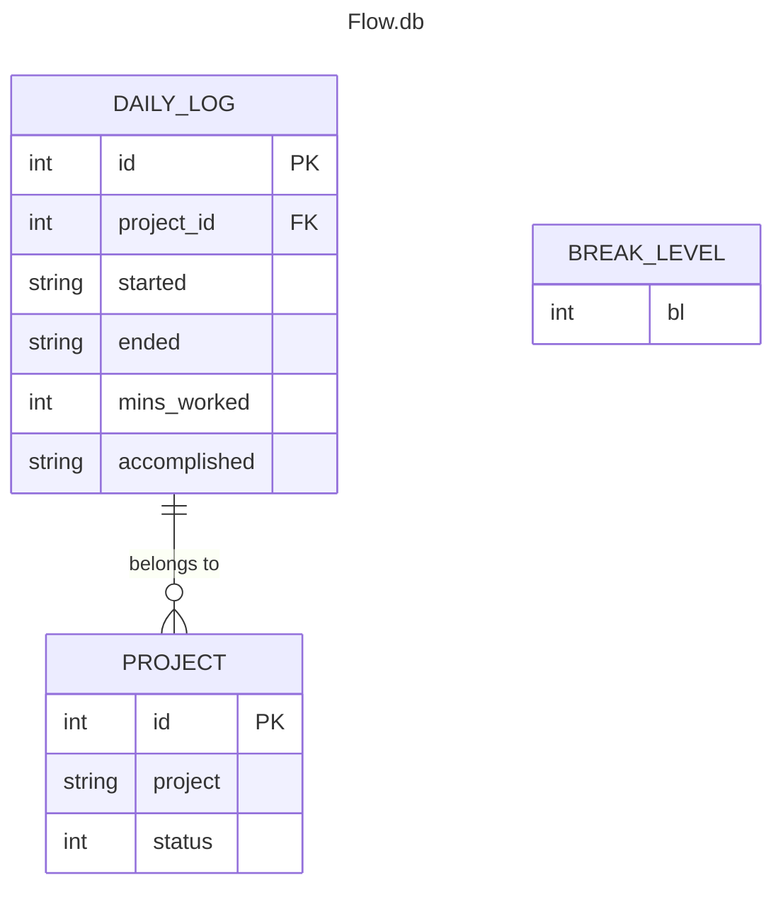

# Flowmodoro a Focus time tracker
A flexible time management tool inspired by Pomodoro technique.
## Description
Based in the popular time managment framework Pomodoro, improving it by beeing able to Start work sessions at your convenience, pause when concentration wanes, and let the system calculate optimal break times based on what Break Level you selected. Tailored productivity for individual rhythms, whether tackling projects or studying.
Furthermore Workometer is a feature that calculates the average time worked per day over the user's last workweek and displays a progress bar to incentivize reaching at least 100% productivit
## Table of Contents
*   [Features](#features)
*   [Requirements](#requirements)
*   [Installation](#installation)
*   [Usage](#usage)
*   [Database Structure](#database-structure)
*   [Contributing](#contributing)
*   [License](#license)
*   [Author](#author)
## Features
## Requirements
- Python 3.6 or superior
- `pip`
- SQLite3
## Installation
1. Clone the repository

```bash
git clone https://github.com/Oddman43/Flowmodoro/tree/working
cd Flowmodoro
```
2. Install requeriments

```bash
pip install -r requeriments.txt
```
## Usage

Uppon oppening the script it will check if `flow.db` exists and create the DataBase if needed with the apropiate schema. It will also do the apropiate queries and compute the average work time last week to be displayed.

Next the instructions to use will be displayed, and the posibility to select a break_level if the user wishes, if not the default break_level of 2, meaning 10 minutes of rest for 60 minutes of working, will be apllied

Once the user has selected a break_level he will need to select a project to work on from the already active projects displayed or create a new one using `!` before the name. The project name will be checked if it exists to avoid missed spelling
Projects are stored in `flow.db` and can be soft deleted by changing the `status` column to 1.

With the break_level selected and a project selected the timer will start, displaying:

* Total time Worked today in format HH:mm
* Current Cycle time in format HH:mm
* A progress bar corresponding to the last week average named Workometer
* Instructions to end the cicle
* A list of cycles done today displaying
    * Number of cycle
    * Time started in format HH:mm
    * Time ended in format HH:mm
    * Time worked in format HH:mm
    * Project name 

## Database Structure
In SQLite3 (`flow.db`) contains three tables `daily_log` `project` `break_level` 
The db schema can be found in `flowmodoro_schema.sql` 
### Table `daily_log`

| Column        | Type | Description                                                                   |
| ------------- | ---- | ----------------------------------------------------------------------------- |
| id            | int  | Primary key, used to identify log                                             |
| project_id    | int  | Foreign key, used to relate to poject                                         |
| started  | str  | Date in YYYY-MM-DD HH:MM:ss corresponding to started date.<br>This column has an Index |
| ended    | str  | Date in YYYY-MM-DD HH:MM:ss corresponding to ended date                                |
| mins_worked   | int  | Number of minutes worked in cycle                                             |
| accomplisdhed | str  | Description of especific things worked on                                     |

### Table `project`

| Column  | Type | Description                                                           |
| ------- | ---- | --------------------------------------------------------------------- |
| id      | int  | Primary key, used to identify project                                 |
| project | str  | Name of the project                                                   |
| status  | int  | Soft deletion of projects, by default populates with 0 meaning active |

### Table `break_level`

| Column | Type | Description                                                                                                                                        |
| ------ | ---- | -------------------------------------------------------------------------------------------------------------------------------------------------- |
| id     | int  | Primary Key |
| break_level | int  | Break Level selected by default, uppon creation populates with 2, meaning the default rest time in flowmodoro of 10 minutes for 60 minutes working |

### Entity Relationship Diagram



## License

This project is licensed under the GNU GENERAL PUBLIC LICENSE Version 3 - see the [LICENSE](..\LICENSE) file for details.

## Author

Author: [Albert Sevilleja Torrents](https://www.linkedin.com/in/albertsevillejatorrents/) 
* GitHub: [Oddman43](https://github.com/Oddman43)
