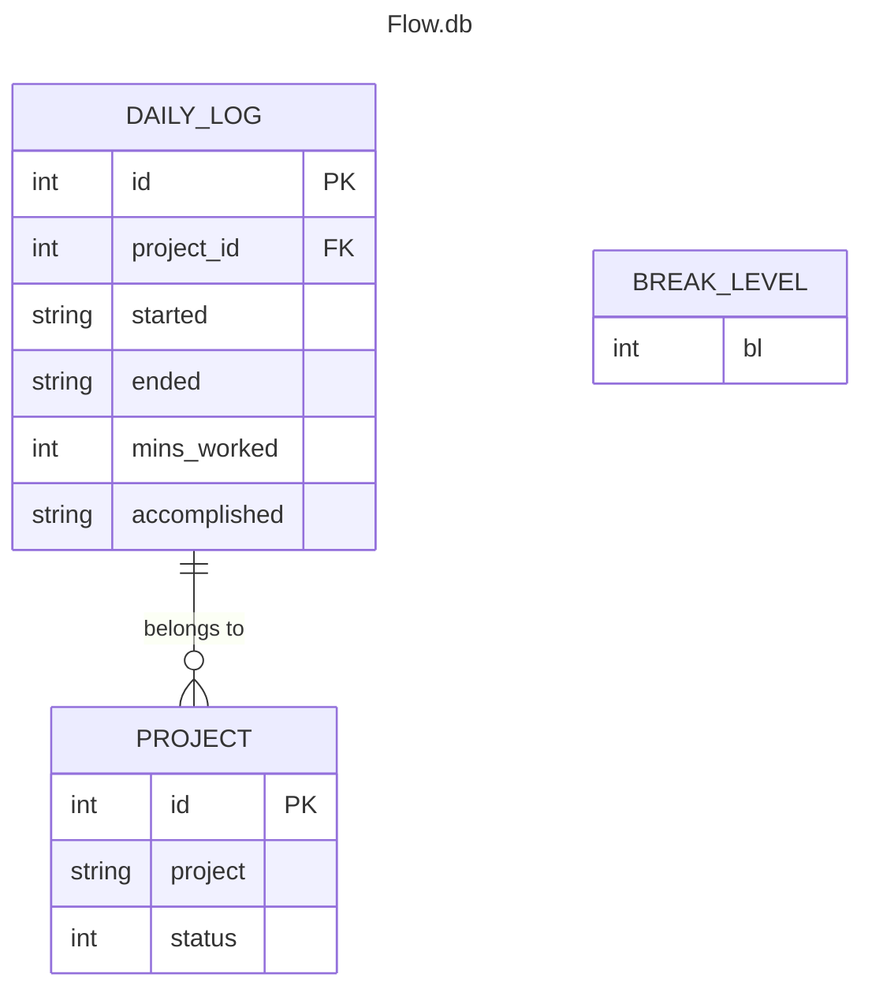

# Flowmodoro a Focus time tracker
A flexible time management tool inspired by Pomodoro technique.
## Description
Based in the popular time managment framework Pomodoro, improving it by beeing able to Start work sessions at your convenience, pause it when concentration wanes, and let the system calculate optimal break times based on what Break Level you selected. Tailored productivity for individual rhythms, whether tackling projects or studying.
## Table of Contents
*   [Features](#features)
*   [Requirements](#requirements)
*   [Installation](#installation)
*   [Usage](#usage)
*   [Database Structure](#database-structure)
*   [Contributing](#contributing)
*   [License](#license)
*   [Author](#author)
## Features
* **Achive Flow state**: Flowmodoro is a tool tailored to enter flow state and take a break just when the focus begins to wein down.
* **Workometer**: Computes the last week average focus time and displays it to incentivize working at least as much as last week.
* **Detailed work log**: Flowmodoro saves all your work cycles in a database, allowing you to track your progress, identify peak productivity times, and analyze your work habits.
* **Apropiated breaks**: Flowmodoro calculates the apropiate breaks.
## Requirements
- Python 3.12.7 or superior
- `pip`
- SQLite3
## Installation
1. Clone the repository
```bash
git clone https://github.com/Oddman43/Flowmodoro/tree/working
cd Flowmodoro
```
2. Install requeriments
```bash
pip install -r requeriments.txt
```
## Usage
Upon opening the script, it will check if `flow.db` exists and create the database with the appropriate schema if needed. It will also perform the necessary queries and compute the average work time from the last week for display.

Next, usage instructions will be displayed, along with the option to select a `break_level`. If the user chooses not to select one, the default `break_level` of 2 (10 minutes of rest for every 60 minutes of work) will be applied.

Once the user has selected a `break_level`, they will need to select a project to work on. They can choose from the already active projects displayed or create a new one by prefixing the name with `!`. The project name will be checked for existence to avoid typos.

Projects are stored in `flow.db` and can be soft-deleted by changing the `status` column.

With the `break_level` and a project selected, the timer will start, displaying:

- Total time worked today (HH:mm)
- Current cycle time (HH:mm)
- A progress bar representing the last week's average work time (Workometer)
- Instructions on how to end the cycle
- A list of cycles completed today, showing:
    - Cycle number
    - Start time (HH:mm)
    - End time (HH:mm)
    - Time worked (HH:mm)
    - Project name

To end a work cycle, press Ctrl+C (or Cmd+C on macOS) to interrupt the script. Upon ending a work cycle, the user will be prompted to describe what was accomplished during that cycle. Finally, the data will be saved to `flow.db`.

The last part of the cycle is the break time. The corresponding break time is calculated, and pressing Enter will begin the break. During the break, a progress bar and the remaining time (MM:ss) will be shown. When the timer ends, an alarm will sound to notify the user that the break is over. Pressing Enter again will start a new work cycle.
## Database Structure
In SQLite3 (`flow.db`) contains three tables `daily_log` `project` `break_level`
The db schema can be found in `data\flowmodoro_schema.sql`
### Table `daily_log`
| Column                 | Type  | Description                                                                             |
| ---------------------- | ----- | --------------------------------------------------------------------------------------- |
| id                     | int   | Primary key, used to identify log                                                       |
| project_id             | int   | Foreign key, used to relate to poject                                                   |
| started                | str   | Date in YYYY-MM-DD HH:MM:ss corresponding to started date.<br>This column has an Index  |
| ended                  | str   | Date in YYYY-MM-DD HH:MM:ss corresponding to ended date                                 |
| mins_worked            | int   | Number of minutes worked in cycle                                                       |
| accomplisdhed          | str   | Description of especific things worked on                                               |
### Table `project`
| Column     | Type  | Description                                                           |
| ---------- | ----- | --------------------------------------------------------------------- |
| id         | int   | Primary key, used to identify project                                 |
| project    | str   | Name of the project                                                   |
| status     | int   | Soft deletion of projects, by default populates with 0 meaning active |
### Table `break_level`
| Column      | Type  | Description                                                                                                                                         |
| ----------- | ----- | --------------------------------------------------------------------------------------------------------------------------------------------------- |
| id          | int   | Primary Key                                                                                                                                         |
| break_level | int   | Break Level selected by default, uppon creation populates with 2, meaning the default rest time in flowmodoro of 10 minutes for 60 minutes working  |
### Entity Relationship Diagram

## License
This project is licensed under the GNU GENERAL PUBLIC LICENSE Version 3 - see the [LICENSE](..\LICENSE) file for details.
## Author
[Albert Sevilleja Torrents](https://www.linkedin.com/in/albertsevillejatorrents/) 
* GitHub: [Oddman43](https://github.com/Oddman43) 
